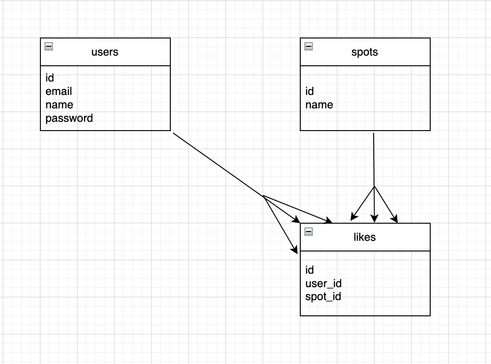

# README

## アプリケーション名
favorite_app

## アプリケーション概要
投稿をお気に入り登録するアプリケーション

## アプリケーション作成背景
ポートフォリオ作成のためにお気に入り登録機能を実装したアプリケーションを作成しました。

## データベース設計

## テーブル設計

## usersテーブル
| Colum    | Type    | Options     |
| -------- | ------- | ----------- |
| email    | string  | null: false |
| name     | string  | null: false |
| password | string  | null: false |

### Association
* has_many :likes

## spotsテーブル
| Colum    | Type    | Options     |
| -------- | ------- | ----------- |
| name     | string  |             |
### Association
* has_many :likes

## likesテーブル
| Colum    | Type    | Options     |
| -------- | ------- | ----------- |
| user_id  | bigint  | null: false |
| spot_id  | bigint  | null: false |

### Association
belongs_to :user
belongs_to :spot

## 開発環境
Ruby / Ruby on Rails / MySQL / Github / Visual Studio Code
